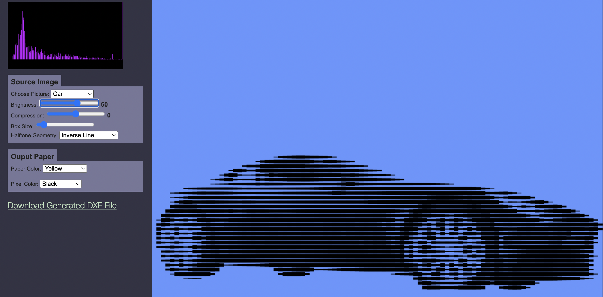

# paperpixels

This is a playground with a lot of image processing and 3D model generation experiments.

### Cut images from paper with Laser Cutter

The file kami4.html takes images and converts to vector cutting paths for a Laser Cutter or X/Y Plotter type cutter.

The UI allows you to select a variety of halftone
rasterization strategies. The image below shows using
a Hilbert space-filling curve and converting luminance
in the source image to the line width in a region.

A more typical application is cutting varying-width lines in a sort
of linear halftone process

